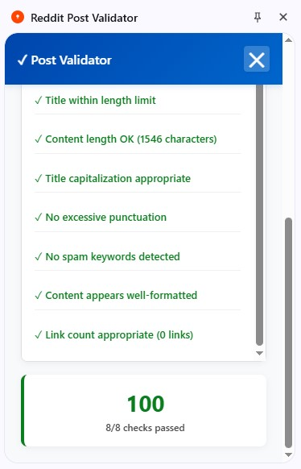

## Reddit Post Validator

A Chrome extension to validate ideas and posts on Reddit by analyzing community feedback and engagement metrics.

## Features

- Analyze Reddit post comments and upvotes for idea validation
- Provide instant feedback on idea viability based on Reddit data
- User-friendly interface integrated as a Chrome extension
- Support for multiple subreddits and filtering options (to be added)
- Extensible backend using AI APIs for advanced analysis (planned)

## Installation

1. Clone the repository:  git clone https://github.com/rubayetafsan/Reddit_Post_Validator.git
2. Open Chrome and go to:  
`chrome://extensions/`
3. Enable **Developer mode** (top right toggle)
4. Click **Load unpacked** and select the cloned project folder
5. The extension icon should appear next to the address bar

## Usage

- Navigate to a Reddit post or subreddit page
- Click the Reddit Post Validator extension icon
- Get real-time validation results on post ideas based on community engagement

## Screenshot

 

---

## Contributing

Contributions, issues, and feature requests are welcome!  
Feel free to check [issues page](https://github.com/rubayetafsan/Reddit_Post_Validator/issues).

